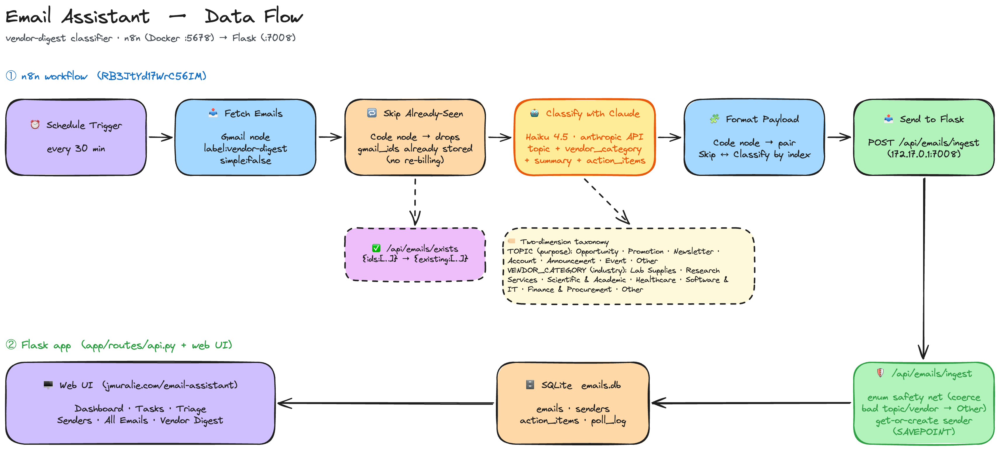

# Email Assistant

An LLM-powered triage layer for a busy academic inbox. An
[n8n](https://n8n.io) workflow fetches external / vendor email, asks
**Claude Haiku** to classify it (topic, urgency, sentiment, action items), and
posts the result to a **Flask dashboard** where you can triage, read digests, and
track follow-ups. Optional Telegram alerts and Nextcloud (calendar/files)
integration are included.



## Architecture — where the "AI" actually lives

The important design point for the talk: **the classification is done by a
low-code n8n pipeline, not by the Flask app.** The Flask app is a read-only
dashboard plus notification/storage services. This split is deliberate — n8n
handles the scheduling, Gmail OAuth, retries, and the Claude call with almost no
code, and the web app stays simple.

```
Gmail (unread, external)
      │   n8n: Schedule Trigger every 30 min
      ▼
n8n: Fetch External Emails ──► n8n: Classify with Claude (Haiku) ──► n8n: Format Payload
                                                                            │
                                                                            ▼
                                        POST /api/emails/ingest  ──►  Flask app + SQLite
                                                                            │
                                                                    Dashboard · Digests ·
                                                                    Telegram · Nextcloud
```

## The n8n workflow (included)

A sanitized export is in [`n8n/Email_Assistant.workflow.json`](n8n/Email_Assistant.workflow.json).
Import it into your own n8n instance (**Workflows → Import from File**), then:

1. Attach **your own** credentials to the two nodes that need them:
   - *Fetch External Emails* → your Gmail OAuth2 credential
   - *Classify with Claude* → your Anthropic API credential
2. In *Fetch External Emails*, edit the search query `q` to match your inbox —
   the example filters unread external mail and excludes your own domain
   (`-@yourdomain.edu`).
3. In *Send to Email Assistant API*, set the URL to wherever this Flask app runs,
   e.g. `http://YOUR_FLASK_HOST:7008/api/emails/ingest`.

The export contains **no credentials or secrets** — only placeholder credential
references you replace with your own.

## Quick start (dashboard)

```bash
cd email-assistant
python3 -m venv .venv && source .venv/bin/activate
pip install -r requirements.txt

cp .env.example .env      # fill in the values you need (see below)
python run.py             # serves on http://localhost:7008
```

SQLite is created automatically under `instance/` on first run. The dashboard
will be empty until the n8n workflow starts posting classified emails to
`/api/emails/ingest` (or you POST test payloads there yourself).

## Configuration (`.env`)

```
SECRET_KEY=...                 # Flask session secret
ANTHROPIC_API_KEY=...          # only needed if you enable in-app LLM features
TELEGRAM_BOT_TOKEN=...         # optional: push alerts
TELEGRAM_CHAT_ID=...           # optional
NEXTCLOUD_URL=...              # optional: file/calendar integration
NEXTCLOUD_USERNAME=...         # optional
NEXTCLOUD_PASSWORD=...         # optional
```

Only `SECRET_KEY` is strictly required to boot the dashboard. Telegram and
Nextcloud are optional add-ons; leave their variables blank to disable them.

## What the classifier produces

Each email is tagged with a `topic`, `urgency`, `sentiment`, `email_type`,
`status`, a short `summary`, `key_points`, and structured `action_items` (with
due dates and priority). The dashboard groups these into triage, digest, sender,
and task views. The topic/category taxonomy lives in `config.py`.

## Note on `app/services/classifier.py`

This file is a **legacy standalone classifier** from an earlier version and is
not used by the current n8n-driven flow — classification happens in n8n. It's
left in as a reference for anyone who wants to run classification inside Python
instead of n8n.

---
Part of **[Workflow to Multi-Agentic Automation](../README.md)** — Murali Jayaraman, Oklahoma Data Science Workshop 2026. MIT licensed (see repository [LICENSE](../LICENSE)).
