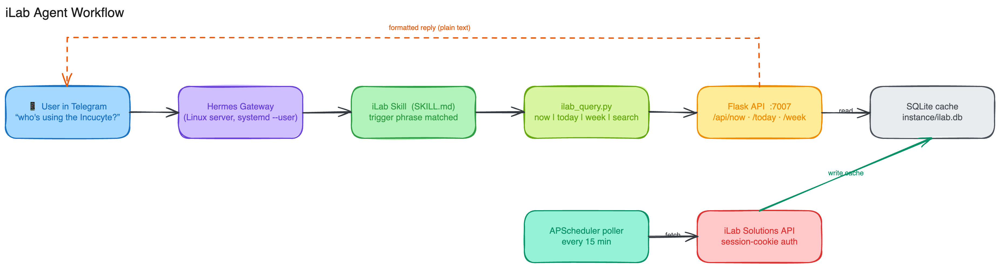

# iLab Equipment Monitor

A small always-on Flask service that watches equipment reservations across shared
research cores on [iLab Solutions](https://www.agilent.com/en/product/software-informatics/ilab-operations-software)
and makes the schedule queryable in plain language — including from your phone
via a Telegram agent.

> Built to answer questions like *"Is the Axioscan free this afternoon?"* or
> *"Who has the Incucyte booked tomorrow?"* without logging into iLab.



## How it works

1. **Auth** — `ilab_client.py` logs into iLab with your session credentials
   (POST to `/account/login`, CSRF token scraped from the login page). The
   session cookie is reused and re-authenticates automatically on expiry.
2. **Poll** — an [APScheduler](https://apscheduler.readthedocs.io/) job
   (`app/poller.py`) fetches reservations every 15 minutes for a window from
   yesterday to two weeks ahead and caches them in SQLite.
3. **Serve** — a tiny JSON API (`app/routes.py`) answers "now / today / tomorrow /
   this week / search" against the cache, so responses are instant and don't hit
   iLab on every request.

The reservation endpoint pattern iLab exposes:

```
GET /schedules/{schedule_id}/service_reservations.json?from=YYYY-MM-DD&to=YYYY-MM-DD&timeshift=300&pp=skip
```

## API

| Endpoint | Returns |
|---|---|
| `GET /api/now` | Reservations active right now |
| `GET /api/today` | Full day schedule |
| `GET /api/tomorrow` | Tomorrow's reservations |
| `GET /api/week` | Next 7 days |
| `GET /api/status` | Last poll time and cache count |

## Quick start

```bash
cd ilab-monitor
python3 -m venv .venv && source .venv/bin/activate
pip install -r requirements.txt

cp .env.example .env      # then edit .env with your iLab login
python run.py             # serves on http://localhost:7007
```

The SQLite database is created automatically under `instance/` on first run.

## Configuration (`.env`)

```
ILAB_USERNAME=your.email@institution.edu
ILAB_PASSWORD=yourpassword
POLL_INTERVAL_MINUTES=15
```

## Adapting it to your cores

The list of cores and instruments to watch lives in `ilab_client.py`. iLab is an
internal, session-cookie API (not a public developer API), so you'll need an
account with access to the cores you want to monitor, and you may need to adjust
the `schedule_id` / `core_id` values to match yours.

## Phone access via a chat agent

In my setup a chat agent (Telegram) calls this app's JSON API and formats the
answer as plain text, so I can ask "who's using X" from anywhere. Any assistant
that can make an HTTP request can do the same — point it at the endpoints above.

---
Part of **[From Workflows to Multi-Agent Automation](../README.md)** — Murali Jayaraman, Oklahoma Data Science Workshop 2026. MIT licensed (see repository [LICENSE](../LICENSE)).
