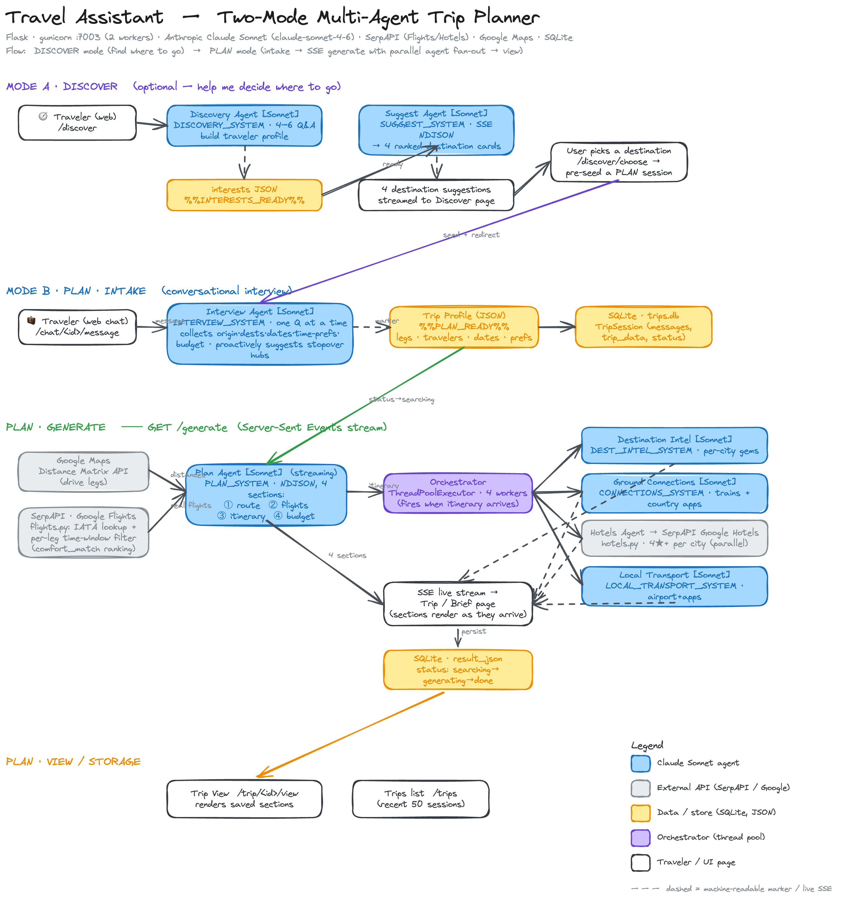
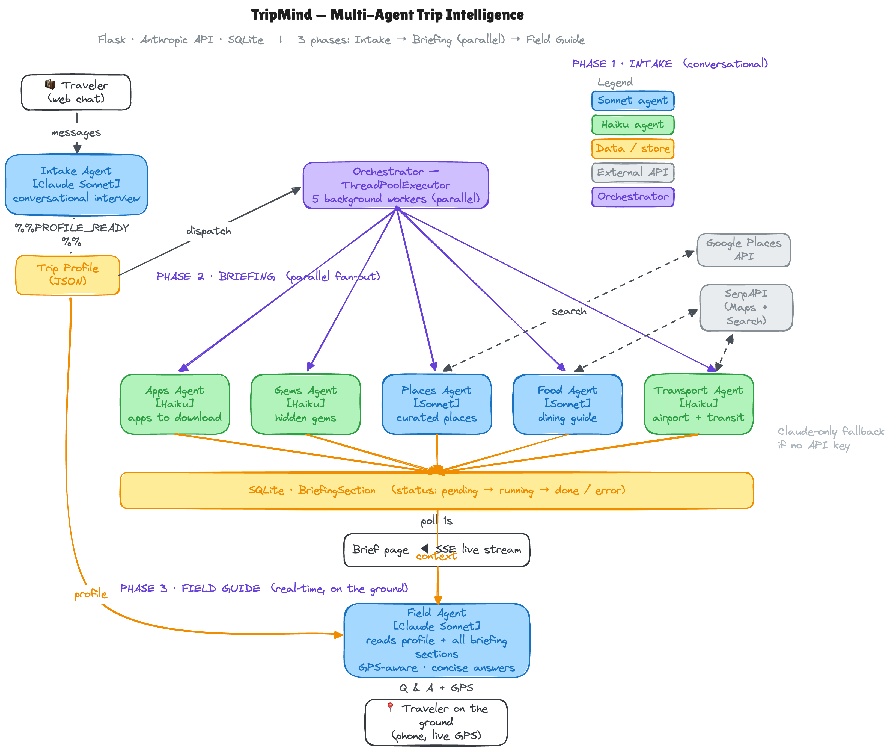

# Travel Assistant (TripMind)

A **multi-agent trip planner**. You describe a trip in natural language; a chain
of Claude Sonnet agents interviews you, plans a route, pulls real flight and
hotel data, and streams a full itinerary to the page live. When the itinerary
lands, an orchestrator fans out four more agents in parallel to enrich it.

This is the "multi-agentic AI" example from the talk — the clearest demonstration
of orchestrating several specialized agents rather than one monolithic prompt.



### The TripMind multi-agent architecture



## The flow

1. **Discover** *(optional)* — a Discovery Agent interviews the traveler, then a
   Suggest Agent streams four destination cards; picking one pre-seeds a plan.
2. **Intake** — an Interview Agent collects origin, dates, budget, and
   preferences (and suggests stopover hubs), emitting a Trip Profile JSON.
3. **Fetch** — Google Maps (drive legs) + SerpAPI Google Flights (per-leg,
   time-window ranked) pull real travel data.
4. **Plan** — a Plan Agent streams route → flights → itinerary → budget as NDJSON.
5. **Fan-out** — an orchestrator fires **four parallel Sonnet agents**:
   Destination Intel, Ground Connections, Hotels (SerpAPI), and Local Transport.
6. **Stream** — every section is pushed to the page live over
   [SSE](https://developer.mozilla.org/en-US/docs/Web/API/Server-sent_events) and
   persisted to SQLite.
7. **View** — `/trip/<id>/view` renders a saved itinerary; `/trips` lists recent
   sessions.

## Why multi-agent?

Each agent has one job and one focused prompt, so it's easier to reason about,
cheaper to run, and parallelizable. The orchestrator (`app/services/planner.py`)
coordinates them and merges their streamed output — the same pattern that
generalizes to research workflows (e.g. one agent per data source, one to
synthesize).

## Stack

Flask · Claude Sonnet · [SerpAPI](https://serpapi.com/) (Google Flights & Hotels)
· Google Maps · SQLite · Server-Sent Events for live streaming.

## Quick start

```bash
cd travel-assistant
python3 -m venv .venv && source .venv/bin/activate
pip install -r requirements.txt

cp .env.example .env      # add your API keys (see below)
python run.py             # serves on http://localhost:7003
```

SQLite is created automatically under `instance/` on first run.

## Configuration (`.env`)

```
SECRET_KEY=change-me
ANTHROPIC_API_KEY=sk-ant-...
GOOGLE_MAPS_API_KEY=AIza...
SERPAPI_KEY=...
CLAUDE_MODEL=claude-sonnet-4-6
```

You'll need your own [Anthropic](https://console.anthropic.com/),
[SerpAPI](https://serpapi.com/), and
[Google Maps Platform](https://developers.google.com/maps) keys. Without SerpAPI
and Maps keys the planner still runs but can't fetch live flight/route data.

## Deployment note

`nginx-travel-block.conf` shows the reverse-proxy `location` block used to serve
the app under a `/travel/` path with SSE buffering disabled (`proxy_buffering off`)
— streaming breaks if the proxy buffers responses.

---
Part of **[From Workflows to Multi-Agent Automation](../README.md)** — Murali Jayaraman, Oklahoma Data Science Workshop 2026. MIT licensed (see repository [LICENSE](../LICENSE)).
